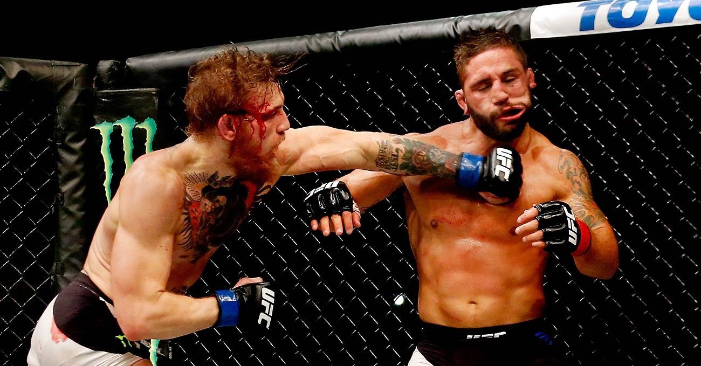
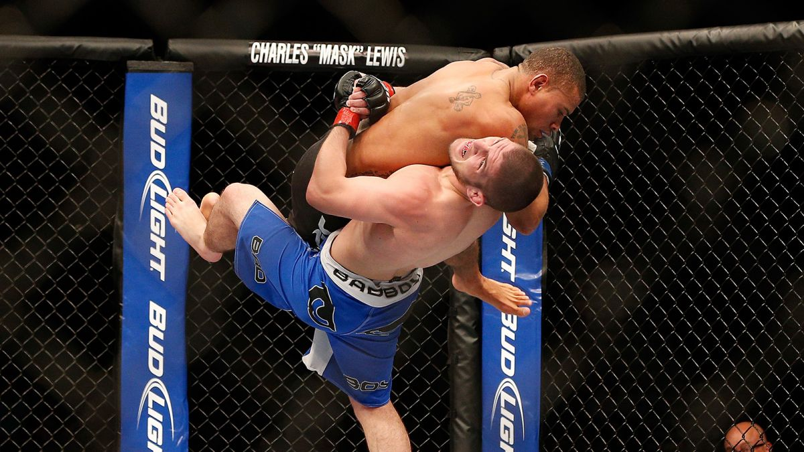
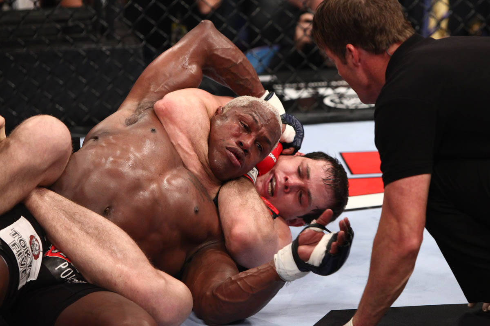

<!-- En haut, compliter/supprimer selon besoin. -->
<!-- Voir les consignes pour le projet. -->

```{r setup, include=FALSE}

knitr::opts_chunk$set(echo = TRUE)
knitr::opts_chunk$set(comment = "")
```

# Introduction

La violence est un excellent moyen d'extérioriser tout les tracas que nous gardons profondément au fond de nous. Cependant il ne faut pas qu'elle soit destructrice. ,il faut que celle-ci soit canalisée. On peut alors l'exprimer sous forme ...
Nous sommes tout les deux passionnés de sport de combats. En effet, nous faisons partie du même club de jiu jitsu brésilien. 

# Présentation des données, analyse descriptive

## Description du dataset et motivation de l'utilisation de cette base de données

Le dataset porte le nom de dataset UFC. L'UFC ou de son nom entier l'Ultimate Fighting Championship est la plus grande organisation au monde de sport de combat Mixed Martial Art (MMA).

Cette base de données contient 5144 combats qui se sont déroulées entre 1993 et 2019. Elle comprends pour chaque combats, 2 combattants qui pour être distingués porte les noms de :  combattant Bleu (B_fighter) et un combattant Rouge (R_fighter). On a différentes informations à propos de l'organisation du combat tel que la date du combat, l'endroit où se fait celui-ci, la catégorie de poids , le nombre de rounds que comporte le combat, l'arbitre qui régulera le combats ou bien encore s'il s'agit d'un combat pour le titre de champion du monde. En plus de cela, on peut trouver, pour chaque combattant, des statistiques personelles physiologique ou encore des performances réalisées lors du combat.

Avant de commencer le projet, il faut mettre en avant comment se déroule un combat de mma. Le combat se déroule entre 2 combattants, celui-ci est régulé par un arbitre. Le combat se déroule dans une cage appelé octogane (car cage de 8 cotés). Le combat se déroule en 3 rounds de 5 mminutes et en 5 rounds de 5 minutes pour un combat d'un titre de champion du monde. Le mma est composé de 70 règles mais celles-ci ne sont pas importantes afin de comprendre ce projet. Cependant, il faut comprendre que le combat peut se dérouler en 3 phases à chaque moment. 

1) Le striking (combats pied, poings, genoux, coud de coude) se pratique en position debout. Possibilité de mettre un adversaire KO.



2) La takedown  (prises de lutte ou de judo) permet de déstabiliser l'adversaire et de soit l'amener au sol soit le maintenir au sol.



3) La submission (prise de jiujitsu brésilien ou luta livre) permet de garder son adversaire au sol et de le soumettre en utilisant par exemple des étranglements, des clefs ou encore des compressions musculaires.



Il y a plusieurs manières de gagner un combat : 

1) Gagner par arrêt du docteur 
2) Gagner par KO technique (Soit l'adversaire est ko soit l'arbitre arrete le combat car combattant quasi ko).
3) Gagner par soumission
4) Gagner par décision (Il y a 2 types de décisions).
  4.1) Gagner par décision unanime.
  4.2) Gagner par split décision.
  
Si le combat ne se termine pas par un ko, une soumission ou un arret du docteur après les 3 ou 5 rounds, ce sont les 3 juges qui prennet la décision de nommer le vainqueur. Les décisions se prennent en fonction du nombre d'actions tentées par chaque adversaire. A chaque action correspond un nombre de points bien précis.


Maintenant que tout est clarifié, nous pouvons commencer le projet en important les données.

## Importation des données 
```{r}
rm(list = ls())
# Import des données à partir du fichier csv
dataUFC <- read.csv('data.csv',header = TRUE,sep = ',', dec = '.')
# Permet d'afficher les 2 dimensions du dataset, çad le nombre de combats avec le nombre de variables pour chaque combat.
dim(dataUFC)
# Affiche les 5 permières lignes du dataset
head(dataUFC, n = 5)
# Visualisation des différentes colonnes
colnames(dataUFC)
```

## Selection des variables intéressantes.

Comme on peut le constater, le nombre de variable est conséquent (145). Une des demandes de ce projet est l'analyse en composantes principales. L'ACP est basée sur de la visualisation. Donc avoir un trop grand nombre de variables est contre productif. Il va donc nous falloir restreindre le nombre de variables et sélectionner des variables intéressantes. 

Dans un premier temps, Nous allons nous concentrer sur l'analyse d'un combattant pour chaque combat, dans ce cas-ci, nous avons choisi de se concentrer sur le combattant Blue. Dans un premier temps, on sélectionne toutes les variables en rapport avec notre combattant Blue. L'objectif dans ce projet étant surtout de constater quelles compétences ou distinctions physiques permet de remporter un combat. Et surtout voir les liens entre les différentes techniques de combats et comment celles-ci peuvent influencer le résultat du combat.

```{r}
dataUFC1 = dataUFC[1:1050,c(1:76,144)]
colnames(dataUFC1)
```

#Selection des variables intéressantes

Pour que vous vérifiez que les données ainsi que les analyses soient cohérentes, on ne va séletionner que les combattants participant à un combat pour le titre de champion du monde. Ces combattants étant connus, leurs compétences sont souvent connus du grand public (même le public hors sport de combat, example : Conor McGregor). Il est donc plus facile pour vous de comprendre les résultats des analyses.

```{r}
typeof(dataUFC1$title_bout)
dataUFC2 <- dataUFC1[which(dataUFC1$title_bout ==  "True"),]
```

Cependant il nous reste encore 77 variables ce qui est un nombre trop conséquent pour la visualisation lors de l'ACP. Nous allons donc choisir les variables suivantes : nom du combattant Blue, la catégorie de poids, la séquence de victoires actuelles, la plus longue séquence de victoire, l'âge du combattant, le nombre de victoire par soumission , le nombre de vicoitre par TKO (Technical KO), le nombre moyen d'attaque à la tête, le nombre moyen d'attaque à la tête atteint, pareil pour les attaques au corps et les attaques de takedowns.

Pour info : un takedown est un mouvement de judo, jiujitsu brésilien ou de lutte qui permet de mettre un adversaire à terre.

```{r}
dataFinal = dataUFC2[,c("B_fighter","weight_class","B_current_win_streak","B_longest_win_streak","B_age","B_win_by_Submission","B_win_by_KO.TKO","B_avg_HEAD_landed","B_avg_LEG_landed","B_avg_GROUND_landed","B_avg_HEAD_att","B_avg_LEG_att","B_avg_GROUND_att")]
```

Nous allons se concentrer sur les combattants masculins car d'une part les combattants masculins représentes une grande majorité des combatset d'autres part cela est pour avoir n'avoir qu'une seule catégorie d'individus.

```{r}
dataFinalWithoutWomen <- dataFinal[!grepl("^Women's.+", dataFinal$weight_class),]
dataCleaned <- dataFinalWithoutWomen[complete.cases(dataFinalWithoutWomen), ]
```

Pour pouvoir mettre en place l'analyse en composante principale, nous allons mettre le noms de combattans en noms de lignes et nous allons en même temps supprimer les doublons de combattants car on ne veut pas prendre en compte plusieurs combats d'un même combattant pour cette analyse.

```{r}
#Mettre  les noms de combattants en noms de lignes
dataCleaned = dataCleaned[!duplicated(dataCleaned$B_fighter), ]
rownames(dataCleaned) = dataCleaned$B_fighter
dataCleaned$B_fighter = NULL
head(dataCleaned)
```
Maintenant notre dataset est prêt pour les différentes analyses. Il comporte 31 observations différentes et 12 variables.

##Analyse descriptive

###Statistique descriptive

Nous allons maintenant faire une analyse descriptive des données afin de pouvoir avoir une meilleure compréhension du dataset. Dans un premier temps, nous allons montrer une matrice de corrélation afin de voir les liens entre les différentes variables continues de notre analyse. 
install.packages("corrplot")
```{r}
summary(dataCleaned)
```

### Matrice de corrélation
Voici 2 manières de visualiser la corrélations entre les variables:
```{r}
library(corrplot)
quantitativeVariables <- dataCleaned[7:12]
dataUFC.cor <- cor(quantitativeVariables)
dataUFC.cor
corrplot(dataUFC.cor)
```

On peut constater qu'une variable _att est fortement correlés à une variable _landed ce qui est logique car un combattant qui essaye d'effectuer un movement de combat (_att) a une chance de toucher son adversaire. On peut aussi remarquer que la corrélation est faible pour certaines variables si on prends les attaques de mise au sol par exemple (_att et _landed) on remarque que les corrélations avec les techniques de striking sont faibles. Ce qui est normal car quand un combattant tente un takedown, il se concentre moins à donner des coups à son adversaire car il doit le déstabiliser pour l'amener au sol. Il n'y a cependant pas de corrélations négatives entre les variables analysées.

# Analyse en composantes principales


## PCA

Pour pouvoir effectuer une analyse en composante principale, on va devoir utiliser le package FactoMineR. Nous devons sélectionner les variables continues de notre dataset final. Après cela, nous allons visualiser les valeurs propres en fonction des composantes afin de sélectionner quelles composantes nous devons choisir pour notre analyse.
```{r}
library(FactoMineR)
res <- PCA(quantitativeVariables, graph = FALSE, ncp = 6)
barplot(res$eig[,"eigenvalue"],xlab = "Composantes",ylab = "Valeurs propres")
abline(h = 1)
```

Par une règle générale, on sélectionne les composantes telles que leurs valeurs propres soient plus grande que 0. On prendra donc les 3 premières composantes pour l'ACP.
```{r}
lapply(res$var,round,3)
```
## Représentation des variables sur les 3 premiers composantes 
En prenant les 3 premières composantes, on aimerait voir la représentation des variables sur ces composantes afin d'évaluer la perte d'information.
```{r}
round(sort(rowSums(res$var$cos2[,1:2])), digits = 3)
round(sort(rowSums(res$var$cos2[,1:3])), digits = 3)
```
On peut constater que les variables en relation avec les attaques aux sols sont très bien représenter sur le 1er plan factoriel.
En prenant en compte les 3 premiers axes factoriels, on remarque qu'une grand quantité de l'information est captée.

## Visualisation 
Pour pouvoir faire une conclusion sur l'analyse en composantes principales, il faut pouvoir visualiser les différents graphe tels que le plan factoriel ainsi que le cercle de corrélation. Nous avons vu cependant que 3 composantes factorielles avaient des valeurs propres >=1 , c'est-à-dire qu'il faut prendre en compte ces 3 composantes. La question à se poser est alors, comment visualiser le plan factoriel si on a 3 composantes. Il faut alors visualiser la chose sur 2 plans factoriels ainsi que 2 cercle de corrélation.

###Répresentation sur le premier plan factoriel

```{r}
plot.PCA(res, choix = "var", axes=c(1,2))
plot.PCA(res, choix = "ind", axes=c(1,2))
```

On peut constater que les variables sont plutôt bien représentées par les 2 premières composantes (51.25% + 30.29% = 81.54%). On ne perds donc pas beaucoup d'informations sur le premier plan factoriel. On peut donc faire une interprétation fiable de la map factorielle des individus ainsi que sa map factorielle des individus associés.

On remarque que sur le premier plan factoriel les variables en relations avec les attaques au sols sont mieux représentées que les attaques en striking car les flèches sont plus proches du cercle de corrélation.

On peut donc voir, en haut à droite, Georges Saint Pierre, qui est considéré comme le meilleur de tout les temps, être un excellent lutteur tout comme Kamaru Usman qui a été Champion de lutte en Amérique avant de commencer sa carrière à l'UFC. A l'inverse en bas à droite, on peut voir Israel Adesanya, qui est l'actuel champion du monde de la catégorie poids léger, avec un excellent striking.

###Répresentation sur le deuxième plan factoriel
```{r}
plot.PCA(res, choix = "var", axes=c(1,3))
plot.PCA(res, choix = "ind", axes=c(1,3))
```

Sur le 2ème plan factoriel (Dim 1 et Dim 3), on remarque que les variables sont représentées à  68.53% (51.25% + 17.28%). On ne perds donc plus d'informations sur le premier plan factoriel mais celà reste raisonnable. On peut constater à l'inverse que les attaques en striking sont mieux représentées que les attaques au sol car les flèches sont plus proches du cercle de corrélation.

Sur le 2eme plan factoriel, on peut encore améliorer notre interprétation à propos d'Israel Adesanya, on peut voir qu'il utilise énormément ces jambes afin de kicker son ardversaire aux jambes et le déstabiliser tout comme Jon Jones qui fut l'ancien champion du monde , poids lourd-léger.

# Clustering 


# Analyse des correspondances


# Conclusions


# Annexes